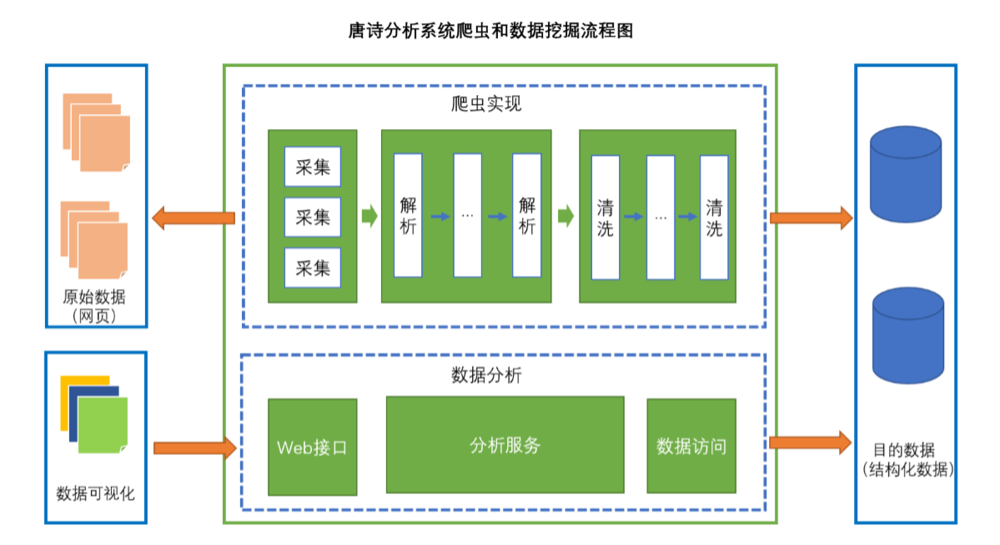

# 项目名称
诗词分析
# 简介
通过抓取互联网上的唐诗，进行数据的清洗、存储、数据分析，最后输出报告
# 使用技术
- Stream流式处理
- 文本分析和解析（ansj）
- 多线程
- 网页解析工具（htmlunit）-DOM解析工具
- 数据库和JDBC编程
- 数据可视化（HTML/CSS/JavaS，echarts，jQuery）
- Servlet/Sparkjava嵌入式Web容器/java-httpd（项目）快速构建Web应用
- 自定义构建对象管理工程
# 实现功能
# 实现过程
- 清洗
- 存储
- 分析
- 展示

# 收获
- 了解数据分析的基本流程
- 熟悉数据分析方法
- 锻炼应用技术解决问题